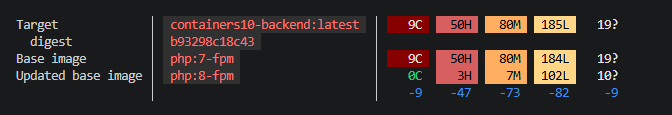

# Лабораторная работа №10. Управление секретами в контейнерах

## Выполнено студетом: Britcov Egor, группа I2402
## Дата выполнения: *02.05.2026*

## Цель работы

Целью работы является изучение методов безопасного управления конфиденциальной информацией (секретами) в контейнеризированных приложениях с использованием Docker.

## Задача

Необходимо создать многосервисное приложение на базе контейнеров, реализовать подключение к базе данных с использованием секретов и обеспечить безопасную передачу конфиденциальных данных между сервисами.

## Ход работы
### Подготовка 

В качестве основы был использован проект из предыдущей лабораторной работы (containers08), который был скопирован в новый репозиторий containers10.

Структура проекта включает:

- Web-приложение на PHP
- Контейнер с веб-сервером (nginx)
- Контейнер с PHP (backend)
- Контейнер с базой данных (MariaDB)

---

### Настройка многосервисного приложения

Для запуска нескольких контейнеров был создан файл `docker-compose.yaml`, в котором описаны три сервиса:

- frontend — отвечает за обработку HTTP-запросов (nginx)
- backend — выполняет PHP-код
- database — хранит данные (MariaDB)

Также были настроены сети:

- frontend — для взаимодействия nginx и backend
- backend — для взаимодействия backend и базы данных

```yaml
services:
  frontend:
    image: nginx:latest
    ports:
      - "80:80"
    volumes:
      - ./site:/var/www/html
      - ./nginx.conf:/etc/nginx/conf.d/default.conf
    networks:
      - frontend

  backend:
    build:
      context: .
      dockerfile: Dockerfile
    environment:
      MYSQL_HOST: database
      MYSQL_DATABASE: my_database
    secrets:
      - user
      - secret
    networks:
      - backend
      - frontend

  database:
    image: mariadb:latest
    environment:
      MYSQL_ROOT_PASSWORD_FILE: /run/secrets/root_secret
      MYSQL_DATABASE: my_database
      MYSQL_USER_FILE: /run/secrets/user
      MYSQL_PASSWORD_FILE: /run/secrets/secret
    secrets:
      - root_secret
      - user
      - secret
    volumes:
      - ./sql:/docker-entrypoint-initdb.d
    networks:
      - backend
      - frontend

networks:
  frontend: {}
  backend: {}

secrets:
  root_secret:
    file: ./secrets/root_secret
  user:
    file: ./secrets/user
  secret:
    file: ./secrets/secret
```

---

### Переход с SQLite на MariaDB

В проекте была заменена база данных SQLite на MariaDB.

Для этого:

- изменён класс Database — теперь используется подключение через DSN
- обновлён index.php — добавено формирование строки подключения
- обновлён config.php — параметры БД теперь берутся из переменных окружения

Пример DSN:

```php
$dsn = "mysql:host={$config['db']['host']};dbname={$config['db']['database']};charset=utf8";
```

index.php:

```php
$db = new Database(
    $dsn,
    $config['db']['username'],
    $config['db']['password']
);
```

---

### Настройка Dockerfile

Dockerfile был обновлён для поддержки MySQL:

```dockerfile
FROM php:7.4-fpm

RUN apt-get update && \
    apt-get install -y libzip-dev && \
    docker-php-ext-install pdo_mysql

COPY site /var/www/html
```

В этом шаге я добавил расширение pdo_mysql, необходимое для работы с MariaDB.

Также был настроен конфигурационный файл `nginx.conf`:

```
server {
    listen 80;

    location / {
        root /var/www/html;
        index index.php index.html;
    }

    location ~ \.php$ {
        fastcgi_pass backend:9000;
        fastcgi_index index.php;
        include fastcgi_params;
        fastcgi_param SCRIPT_FILENAME /var/www/html$fastcgi_script_name;
    }
}
```

---

### Создание и использование секретов

Для хранения конфиденциальных данных была создана папка secrets, содержащая:

- root_secret — пароль root
- user — имя пользователя
- secret — пароль пользователя

---

### Подключение секретов в docker-compose

В `docker-compose.yaml` была добавлена секция:

```yaml
secrets:
  root_secret:
    file: ./secrets/root_secret
  user:
    file: ./secrets/user
  secret:
    file: ./secrets/secret
```

Сервис базы данных был настроен на использование этих секретов:

```yaml
environment:
  MYSQL_ROOT_PASSWORD_FILE: /run/secrets/root_secret
  MYSQL_DATABASE: my_database
  MYSQL_USER_FILE: /run/secrets/user
  MYSQL_PASSWORD_FILE: /run/secrets/secret
```

---

### Использование секретов в приложении

В `config.php` доступ к секретам реализован через чтение файлов:

```php
$config['db']['username'] = trim(file_get_contents('/run/secrets/user'));
$config['db']['password'] = trim(file_get_contents('/run/secrets/secret'));
```

Таким образом, секреты не хранятся в коде и не попадают в образ.

---

### Автоматическая инициализация базы данных

Для автоматического создания таблиц был создан файл:

`sql/init.sql`

```sql
CREATE TABLE IF NOT EXISTS page (
    id INT AUTO_INCREMENT PRIMARY KEY,
    title TEXT,
    content TEXT
);

INSERT INTO page (title, content) VALUES 
('Page 1', 'Content 1'),
('Page 2', 'Content 2'),
('Page 3', 'Content 3');
```

И подключён в контейнер базы данных:

```yaml
volumes:
  - ./sql:/docker-entrypoint-initdb.d
```

При первом запуске контейнера база данных автоматически создаётся и заполняется.

---

### Запуск приложения

Для запуска использовалась команда:

```
docker-compose up --build
```

После запуска:

- nginx обрабатывает запросы
- PHP выполняет логику
- MariaDB хранит данные

проверяем через  `http://localhost`


---

### Проверка безопасности

Проверка образа выполняется командой:

```
docker scout quickview containers10-backend
```



Позволяет выявить уязвимости и оценить безопасность образа.

---

### Ответы на вопросы

- Почему плохо передавать секреты в образ при сборке?

Потому что образ может быть опубликован или передан другим пользователям, и все секреты станут доступными. Это создаёт угрозу безопасности, так как данные невозможно изменить без пересборки образа.

- Как можно безопасно управлять секретами в контейнерах?

Секреты следует хранить вне образа и передавать их во время запуска контейнера. Это можно сделать с помощью переменных окружения или специальных механизмов, таких как Docker Secrets.

- Как использовать Docker Secrets?

Docker Secrets позволяют хранить конфиденциальные данные в виде файлов, доступных контейнеру по пути `/run/secrets/....` Контейнер читает данные из этих файлов, не включая их в образ и не раскрывая в конфигурации.

---

### Вывод

В ходе работы было создано многосервисное приложение с использованием Docker Compose, реализовано безопасное хранение и передача секретов, а также настроено автоматическое развёртывание базы данных. Использование Docker Secrets позволило повысить уровень безопасности приложения и исключить хранение конфиденциальных данных в исходном коде и образах контейнеров.